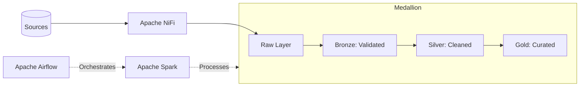

# Enterprise Multi-Cloud Data Engineering Platform

A mission-critical data engineering platform demonstrating the **Medallion Architecture**, automated **Data Quality** patterns, and **Multi-Cloud** infrastructure.

## Platform Core

This platform provides a robust foundation for scalable data processing, transforming fragmented source data from relational and NoSQL systems into high-value analytical marts.

*   **Ingestion**: High-availability pipeline moving data from PostgreSQL, MySQL, MongoDB, and Cassandra.
*   **Orchestration**: Production-grade Airflow DAGs with sensors, automated retries, and comprehensive error handling.
*   **Transformation**: Modular PySpark framework enforcing schemas, masking PII, and generating a Star Schema.
*   **Infrastructure**: Fully-defined Terraform modules for AWS, GCP, and Azure environments.

## System Architecture

## Engineering Documentation

*   [Deployment: Local Development](docs/local_setup.md)
*   [Architecture: Medallion Flow](docs/architecture.md)
*   [Cloud Infrastructure: AWS](docs/cloud_deployment_aws.md)
*   [Cloud Infrastructure: GCP](docs/cloud_deployment_gcp.md)
*   [Cloud Infrastructure: Azure](docs/cloud_deployment_azure.md)
*   [Data Governance: Model & Star Schema](docs/data_model.md)
*   [Security & Compliance: GDPR/LGPD](docs/security_compliance.md)
*   [Operational Excellence: Data Quality](docs/data_quality.md)
*   [SRE: Operations Runbook](docs/operations_runbook.md)
*   [Production Hardening Roadmap](docs/production_hardening_checklist.md)

## Key Technical Specifications

*   **Idempotency**: All Spark jobs use `dynamic` partition overwrite mode to ensure safe re-runs.
*   **Schema Enforcement**: Bronze layer implements strict Spark `StructType` validation.
*   **Security**: SHA-256 PII masking for sensitive fields (Email, Phone) at the Silver layer.
*   **Scalability**: Native partitioning strategy by `ingestion_date`.
*   **Quality**: Quarantine pattern for isolating failed records without breaking the pipeline.

## Getting Started

Consult the [Local Setup Guide](docs/local_setup.md) to initialize the platform on your development machine.
