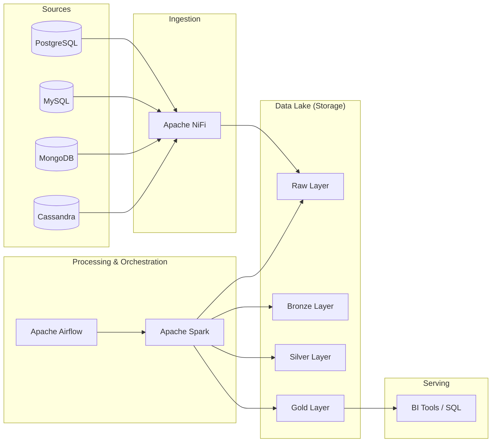

# Multi-Cloud Data Engineering Platform

A production-grade, end-to-end data engineering platform demonstrating modern batch pipeline architecture, multi-source ingestion, and multi-cloud compatibility.

## Project Overview

This project simulates a real-world data platform that ingests customer, order, and event data from multiple source systems (PostgreSQL, MySQL, MongoDB, Cassandra), processes it through a Medallion Architecture (Raw -> Bronze -> Silver -> Gold), and serves analytical insights.

### Key Features
- **Multi-Source Ingestion**: Relational (PostgreSQL, MySQL) and NoSQL (MongoDB, Cassandra) sources.
- **Medallion Architecture**: Clear separation of data layers for quality and reliability.
- **Orchestration**: Production-style Airflow DAGs with retry logic and dependencies.
- **Processing**: Modular PySpark jobs for scalable transformations.
- **Data Quality**: Automated checks for nulls, duplicates, and referential integrity.
- **Security & Compliance**: Integrated GDPR/LGPD concepts and data masking.
- **Multi-Cloud Ready**: Deployment guides for AWS, GCP, and Azure.

## Architecture



## Quick Start (Local Environment)

### Prerequisites
- Docker and Docker Compose
- Python 3.9+
- Make (optional)

### Setup
1. Clone the repository:
   ```bash
   git clone https://github.com/your-username/multi-cloud-data-engineering-platform.git
   cd multi-cloud-data-engineering-platform
   ```

2. Configure environment variables:
   ```bash
   cp .env.example .env
   ```

3. Start the platform:
   ```bash
   make up
   # or
   docker-compose up -d
   ```

4. Initialize sample data:
   ```bash
   make init-data
   ```

5. Access services:
   - **Airflow**: [http://localhost:8080](http://localhost:8080) (admin/admin)
   - **NiFi**: [https://localhost:8443](https://localhost:8443) (admin/nifipassword123)
   - **Spark Master**: [http://localhost:8081](http://localhost:8081)

## Project Structure

```text
.
├── dags/               # Airflow DAGs
├── spark/              # PySpark jobs and transformations
├── sql/                # SQL scripts (DDL, Analytics, DQ)
├── nifi/               # NiFi configuration and docs
├── databases/          # Source database init scripts
├── docs/               # Detailed documentation
├── tests/              # Unit and Spark tests
└── infrastructure/     # Cloud-specific templates
```

## Documentation
- [Architecture Details](docs/architecture.md)
- [Cloud Deployment (AWS)](docs/cloud-aws.md)
- [Cloud Deployment (GCP)](docs/cloud-gcp.md)
- [Cloud Deployment (Azure)](docs/cloud-azure.md)
- [Security & Compliance](docs/security-compliance.md)
- [Data Model](docs/data-model.md)
- [Data Quality Strategy](docs/quality_checks.md)

## License
MIT
