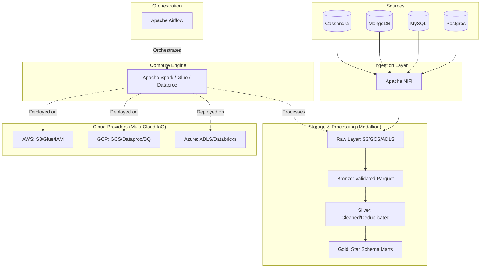

# Enterprise Multi-Cloud Data Engineering Platform

A mission-critical data engineering platform demonstrating the **Medallion Architecture**, automated **Data Quality** patterns, and **Multi-Cloud** infrastructure.

## 💼 Business Problem
Modern enterprises struggle to unify data from heterogeneous sources (relational, NoSQL, streaming) into a reliable analytical layer across multi-cloud environments. This platform solves that by providing:
- **Unified Ingestion**: Apache NiFi handles data from PostgreSQL, MySQL, MongoDB, and Cassandra without custom connectors.
- **Governed Transformations**: Medallion Architecture enforces Bronze → Silver → Gold data contracts.
- **Compliance by Design**: PII masking and LGPD/GDPR controls built into the Silver layer transformation.
- **Cloud Agnosticism**: Terraform modules independently deployable to AWS, GCP, or Azure.

## 🏅 Project Maturity & Senior Patterns
This repository implements high-level engineering standards:
- **Dependency Isolation**: Managed via **Poetry** for reproducible runtimes.
- **Data Governance**: Automated quality gates using **Great Expectations** at each layer.
- **Storage Evolution**: **Delta Lake** implementation for ACID transactions and Time Travel.
- **Health-Aware Orchestration**: Docker healthchecks and service-ready dependencies.
- **Security-First**: Pre-commit hooks for secret detection, bandit security scanning, and strict type checking.
- **IaC Reliability**: Remote state management and provider version locking for Terraform.
- **Full Observability**: Centralized logging, metrics scraping (Prometheus), and visual monitoring (Grafana).

## 🛠 Tech Stack
| Component | Technology | Role |
|-----------|------------|------|
| **Ingestion** | Apache NiFi | Scalable multi-source data collection and movement. |
| **Orchestration** | Apache Airflow | Workflow scheduling, dependency management, and monitoring. |
| **Processing** | PySpark (Spark 3.4) | Large-scale distributed data transformations. |
| **Storage** | **Delta Lake** | ACID transactions, upserts, and time-travel on object storage. |
| **Data Quality** | **Great Expectations**| Declarative data validation and automated DQ reporting. |
| **Infrastructure** | Terraform | Reproducible multi-cloud infrastructure as code with remote backends. |
| **Observability** | **Prometheus/Grafana**| Metrics collection and dashboarding for pipeline health. |
| **Security** | SHA-256 / Bandit | PII masking and static application security testing. |

## 🏗 System Architecture

## 🚀 Getting Started

### Path A: Local Development (Docker)
This is the fastest way to explore the platform architecture locally.
1. **Prepare Environment**: `cp .env.example .env`
2. **Launch Stack**: `make up` (Starts Airflow, NiFi, Spark, and 4 databases).
3. **Seed Data**: `make init-data` (Simulates ingestion trigger).
4. **Access Airflow**: Visit `localhost:8080` (admin/admin).

### Path B: Local Observability
Launch the monitoring stack to view metrics and dashboards.
1. **Start Observability**: `make observability-up`
2. **Grafana**: Visit `localhost:3000` (admin/admin). Access the pre-provisioned "Airflow Data Platform Dashboard".
3. **Prometheus**: Visit `localhost:9090` to query raw metrics.

### Path C: Cloud Deployment (IaC)
To deploy the platform to a production cloud environment, consult the specific deployment guides:
- [AWS Deployment Guide](docs/cloud_deployment_aws.md)
- [GCP Deployment Guide](docs/cloud_deployment_gcp.md)
- [Azure Deployment Guide](docs/cloud_deployment_azure.md)

## 🧪 Quality & Verification
The project enforces strict quality standards via the `Makefile`:
- `make lint`: Ruff check + fix.
- `make type-check`: Mypy strict mode.
- `make security-scan`: Bandit security report.
- `make test`: Run all Pytest suites.
- `make all-checks`: Sequence of all the above.

## 📜 License
Distributed under the MIT License. See `LICENSE` for more information.
