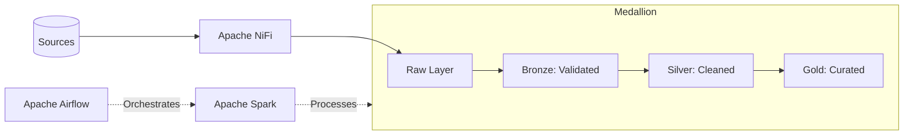

# Enterprise Multi-Cloud Data Engineering Platform

A professional-grade, end-to-end data engineering platform implementing the **Medallion Architecture** (Raw -> Bronze -> Silver -> Gold) with multi-cloud deployment capabilities.

## Architecture Overview

The platform is designed to handle high-volume batch data processing using modern tools and best practices.

*   **Ingestion Layer**: Apache NiFi extracts data from PostgreSQL, MySQL, MongoDB, and Cassandra into a Raw landing zone.
*   **Orchestration Layer**: Apache Airflow manages complex DAGs with sensors, retries, and failure callbacks.
*   **Processing Layer**: Apache Spark (PySpark) performs scalable transformations across data layers.
*   **Storage Layer**: Parquet-based Data Lake with a Star Schema in the Gold layer.

## Documentation

*   [Local Setup Guide](docs/local_setup.md)
*   [Medallion Architecture Details](docs/architecture.md)
*   [Cloud Deployment: AWS](docs/cloud_deployment_aws.md)
*   [Cloud Deployment: GCP](docs/cloud_deployment_gcp.md)
*   [Cloud Deployment: Azure](docs/cloud_deployment_azure.md)
*   [Data Model (Star Schema)](docs/data_model.md)
*   [Security & Compliance (GDPR/LGPD)](docs/security_compliance.md)
*   [Data Quality Strategy](docs/data_quality.md)
*   [Operations Runbook](docs/operations_runbook.md)
*   [Production Hardening Checklist](docs/production_hardening_checklist.md)

## Key Technical Features

*   **Production Spark Jobs**: Type-hinted, structured logging, schema enforcement, and idempotent partitioning.
*   **Star Schema**: Implements `dim_customers`, `dim_products`, `fact_orders`, and analytical marts.
*   **Data Quality**: Quarantine pattern for failed records, null checks, and referential integrity.
*   **PII Masking**: GDPR-compliant SHA-256 hashing for sensitive fields.
*   **Multi-Cloud IaC**: Actual Terraform modules for AWS, GCP, and Azure.
*   **CI/CD**: Comprehensive GitHub Actions workflow with linting and automated tests.

## Getting Started

Refer to the [Local Setup Guide](docs/local_setup.md) to spin up the platform using Docker Compose and initialize the sample datasets.
